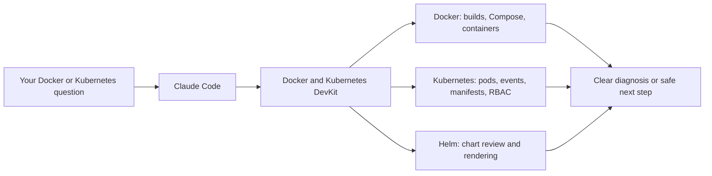

# Docker and Kubernetes DevKit

Give Claude Code a careful, practical DevOps teammate for Docker and Kubernetes work.

Docker and Kubernetes DevKit helps turn the moments that normally send you hunting through logs into a short, evidence-backed conversation: a failing build, a pod that never starts, a Service with no endpoints, a chart that is almost ready to ship, or a manifest that needs to be safe by default.

It is designed to be useful on a laptop with Docker Desktop just as much as in a production-oriented repository. It reads first, explains what it found, and asks before doing anything destructive.



## Install from GitHub or a ZIP file

This project is intentionally easy to use without a marketplace account. Download the [latest GitHub ZIP](https://github.com/mohitkale/docker-kubernetes/archive/refs/heads/main.zip), unzip it, and load the folder into Claude Code.

```bash
cd ~/Downloads
unzip docker-kubernetes-main.zip
claude --plugin-dir "$PWD/docker-kubernetes-main"
```

Claude Code can also load the ZIP directly:

```bash
claude --plugin-dir ~/Downloads/docker-kubernetes-main.zip
```

If you already cloned the repository, run this from its root:

```bash
claude --plugin-dir .
```

The plugin is active for that Claude Code session. For a convenient repeatable launch, keep the extracted folder in a stable location and use the same `--plugin-dir` command. No API keys, MCP configuration, or project settings file are required.

## What you can ask for

| When you say… | DevKit helps by… |
|---|---|
| “Why does this Docker build fail?” | Reading the build context, image metadata, logs, and Dockerfile to identify the root cause. |
| “Add Postgres and Redis locally.” | Creating or improving a safe, health-checked Compose setup. |
| “This pod is not starting.” | Pulling status, describe output, events, and the right logs without changing the cluster. |
| “Make this app deployable.” | Writing production-minded Kubernetes manifests with resource limits, probes, labels, and security defaults. |
| “Is this Helm chart ready?” | Reviewing chart metadata, templates, RBAC, resources, probes, and image practices. |
| “Is this access too broad?” | Auditing Roles, ClusterRoles, bindings, and service-account permissions for least privilege. |

## A few real-world workflows

### Find a broken container quickly

```text
/docker-kubernetes:docker-debug payments-api
```

Typical response:

```text
Root cause: the container exits because PORT is unset at startup.

Evidence:
- docker inspect shows exit code 1.
- Container logs report: "PORT must be set".

Fix: set PORT=3000 in the runtime environment, then run the image again.
```

### Understand a pod that cannot start

```text
/docker-kubernetes:k8s-debug api-7c4d8b9f5d-xzq4p staging
```

Typical response:

```text
Root cause: the pod cannot start because its configured command does not exist in the image.

Evidence:
- State: StartError
- exec: "/app/serve": stat /app/serve: no such file or directory

Fix: change command/args to match the image ENTRYPOINT and CMD.
```

### Start with safer manifests

```text
/docker-kubernetes:manifest a Node API called catalog with 3 replicas and an Ingress
```

DevKit will use consistent Kubernetes labels, a pinned image tag, resource requests and limits, probes, non-root execution, and a PodDisruptionBudget when appropriate.

### Check a chart before a release

```text
/docker-kubernetes:helm-review ./charts/catalog
```

The review is read-only. It points out concerns such as `latest` tags, missing probes, broad RBAC, absent NetworkPolicies, or template patterns that make a chart hard to operate.

## Commands

Use commands from inside Claude Code with the `docker-kubernetes:` prefix.

| Command | Use it when… |
|---|---|
| `/docker-kubernetes:doctor` | You want a quick local Docker and Kubernetes health check. |
| `/docker-kubernetes:runtime-check` | You need to know which host, WSL, Docker Desktop, Kubernetes, Helm, or local-cluster path is available. |
| `/docker-kubernetes:smoke-test` | You explicitly want to verify Docker, Compose, Helm, and kubectl locally. |
| `/docker-kubernetes:events [namespace] [Warning\|Normal]` | You need a recent, ordered event snapshot. |
| `/docker-kubernetes:cluster-audit [namespace]` | You want one opt-in, read-only Docker/Kubernetes/RBAC/Helm review. |
| `/docker-kubernetes:dockerfile [framework]` | You want a production-minded Dockerfile and `.dockerignore`. |
| `/docker-kubernetes:compose [services]` | You want a local multi-service Compose setup. |
| `/docker-kubernetes:docker-debug [container-or-error]` | A build, image, or container is failing. |
| `/docker-kubernetes:k8s-debug <pod> [namespace]` | A pod or workload is not healthy. |
| `/docker-kubernetes:manifest <description>` | You want Kubernetes YAML from a plain-English description. |
| `/docker-kubernetes:helm-review [chart-path]` | You want a static Helm chart review. |
| `/docker-kubernetes:rbac-review [namespace]` | You want a least-privilege RBAC audit. |

## Built to be safe around real infrastructure

- Diagnostic commands use read-only Docker and Kubernetes operations by default.
- Changes such as `kubectl apply`, `delete`, `patch`, `edit`, image removal, or pruning require your explicit approval.
- The plugin does not print values from `.env` files or Kubernetes Secrets.
- Session hooks only look for project markers such as Dockerfiles, Compose files, charts, and manifest folders. They do not send project data to a separate service.
- The optional smoke test creates a temporary scratch image and temporary files, then removes them. It does not apply Kubernetes resources or install a Helm release.

## Local setup

The plugin itself has no package installation step. These tools unlock the matching capabilities:

| Capability | What you need |
|---|---|
| Docker and Compose workflows | Docker Desktop or Docker Engine with `docker compose` |
| Kubernetes workflows | `kubectl` and a valid context, such as Docker Desktop’s `docker-desktop` |
| Helm rendering smoke checks | Helm on your PATH (`brew install helm` on macOS) |
| Hooks | Node.js on your PATH |

Start with:

```text
/docker-kubernetes:runtime-check
/docker-kubernetes:doctor
```

To run the deliberate local verification path:

```text
/docker-kubernetes:smoke-test --target host
```

## What the smoke test proves

When the tools are available, it checks all of the following without leaving a workload behind:

1. Docker daemon access.
2. A no-network `FROM scratch` image build, inspection, and cleanup.
3. Compose configuration rendering.
4. Helm linting and template rendering for a generated temporary chart.
5. kubectl client access and local object generation with an isolated kubeconfig.
6. Kubernetes API reachability.

## Current boundaries

- Helm review is intentionally static; it never runs `helm install` or `helm upgrade`.
- The plugin does not yet include image scanning, Kustomize workflows, or Helm chart generation.
- Windows container scenarios are not specifically tuned.

## Developing the plugin

```bash
node tests/run.js
claude plugin validate .
node bin/runtime-check.js
node bin/smoke-test.js --target host
```

The offline test suite does not need Docker, Kubernetes, Helm, or a live cluster. The runtime and smoke commands are explicit opt-in checks.

## Privacy and support

See [PRIVACY.md](PRIVACY.md) for the data-handling summary. For questions, feature requests, or bug reports, use the repository’s GitHub Issues page.

## License

MIT. See [LICENSE](LICENSE).
